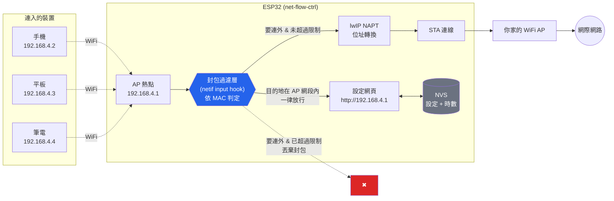
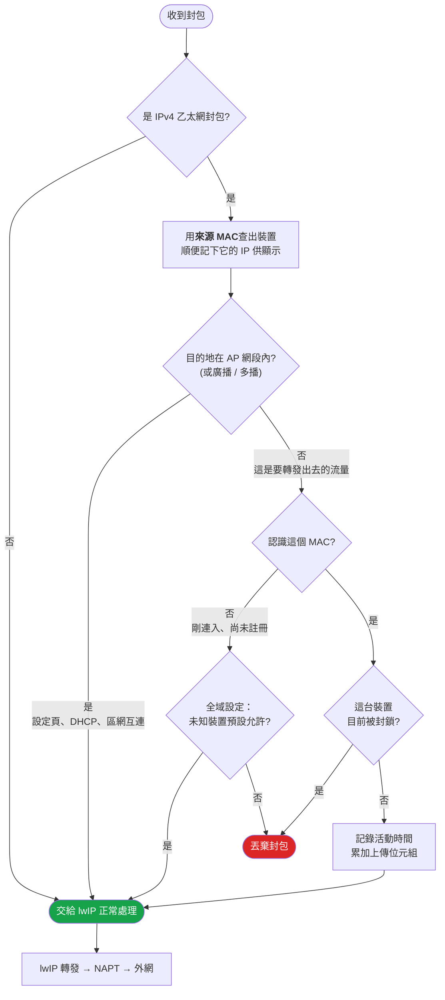
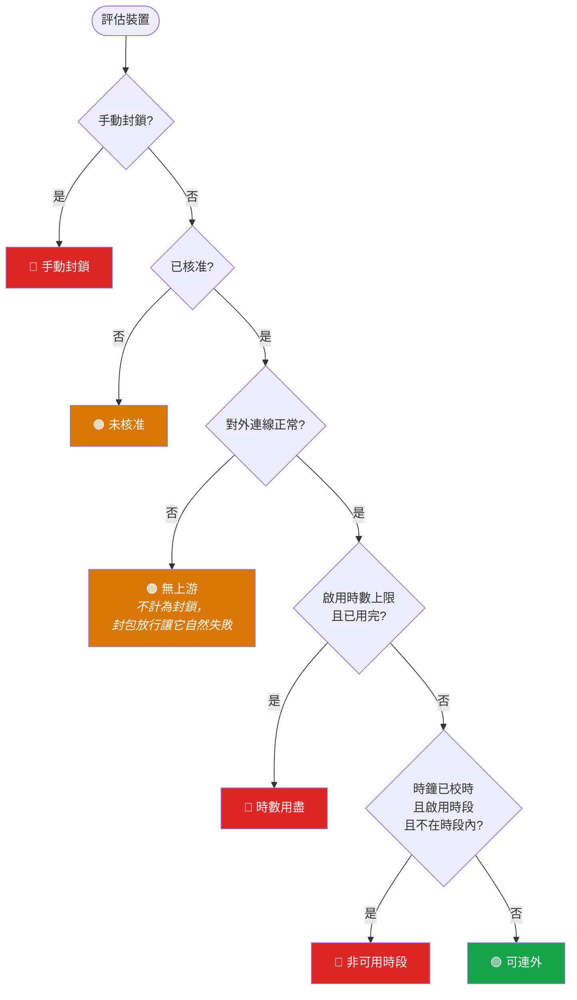
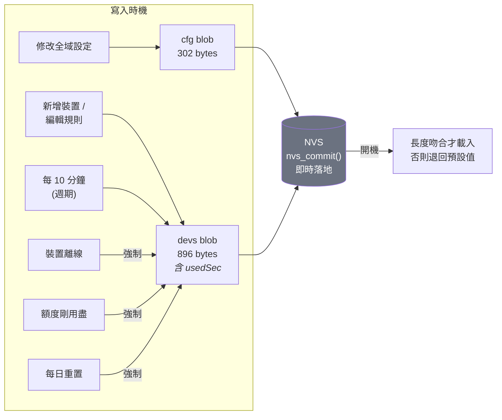
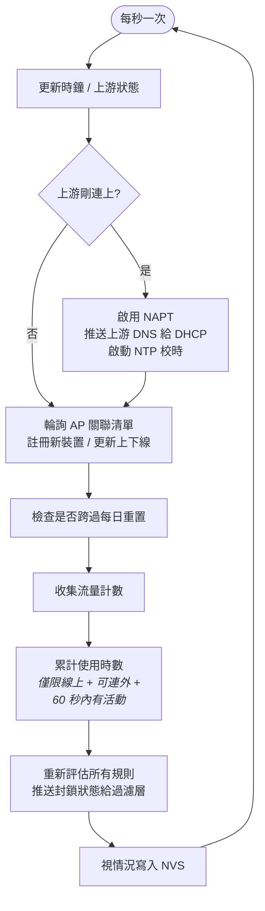

# net-flow-ctrl

ESP32 雙模 WiFi 路由器，可針對**每一台**連入熱點的裝置，個別限制它連到外網的**時段**與**每日累積時數**。

裝置連上 ESP32 的熱點，流量經 NAPT 轉發到你家的 WiFi AP 出去。超過限制的裝置會被切斷外網，但**仍然連得上熱點、也開得了設定頁**——只有要轉出去的封包被丟棄。所有設定與時數統計都存在 NVS，斷電不遺失。

---

## 功能

| | 說明 |
|---|---|
| **雙模連線** | 同時作為 STA（連你家 AP）與 AP（供裝置連入），NAPT 轉發提供連外 |
| **限制一：時段** | 例如只允許 06:00–21:00 連外，超出即斷網。支援跨午夜（如 22:00–02:00） |
| **限制二：每日時數** | 例如每天只能連外 8 小時，用完即斷網 |
| **任一超過即斷網** | 兩種限制獨立啟用，任一項超過就切斷外網，直到隔日重置時間 |
| **每日重置** | 預設早上 05:00 歸零所有裝置的已用時數（可調） |
| **網頁設定介面** | 連上熱點開 `http://192.168.4.1`，免安裝 App |
| **白名單模式** | 可設定未知新裝置預設封鎖，需在設定頁逐台核准 |
| **手動封鎖** | 永久封鎖某裝置，不受每日重置影響 |
| **流量統計** | 顯示每台裝置今日上傳／下載量（僅供參考，不作為限制條件） |

**時數只在裝置實際有連外流量時累計**，閒置 60 秒即停止計時——手機放口袋整晚不會吃掉額度。

---

## 系統架構



關鍵設計：**設定頁走的是 AP 網段內部流量，不經過封鎖判定**，所以被斷網的裝置照樣能開設定頁看自己還剩多少額度。

---

## 封包決策流程

每一個從裝置送進來的封包都會經過這段判斷（執行在 WiFi RX 任務）：



**為什麼用 MAC 而不是 IP 當索引？** MAC 就在乙太網標頭裡，不需等 DHCP 租約觀測、第一個封包就能判定，而且經過 WPA2 關聯認證，裝置無法自行更改。若用 IP，裝置斷線後 IP 綁定被清除，重連到主迴圈重新綁定之間會有約 1 秒空窗套用「預設允許」——反覆重連就能繞過限制。

---

## 規則判定順序

主迴圈每秒重新評估每台裝置，結果推送給過濾層：



### 時鐘失效時的行為（重要）

| 限制 | 無法校時（NTP 未同步）時 |
|---|---|
| **每日時數** | **照樣執行封鎖** |
| **時段** | 放行 |

**時數是累計秒數，不需要牆上時鐘**，所以即使 NTP 未同步也照樣執行——否則反覆斷電重開就能在 NTP 同步前的空窗期偷到免費上網，等於功能失效。

**時段沒有時鐘就無從判斷**，只能放行。這是刻意的取捨：若改為 fail-closed，NTP 一掛全家永久斷網且原因不明。設定頁會在狀態列顯示「未校時」警告，你也可以手動重置時數。

---

## 每日重置

計數器歸屬的「邏輯日」是把時鐘往回撥重置時間後取日期，所以換日恰好發生在重置時刻，且**重開機或錯過重置都能正確判斷**（不依賴計時器）。

```
邏輯日 = 日期( 現在時刻 − 重置時間 )
```

以預設 05:00 重置為例：

| 實際時刻 | 邏輯日 | 行為 |
|---|---|---|
| 07/17 04:59 | `20260716` | 仍屬前一日，昨日額度繼續計算 |
| 07/17 **05:00** | `20260717` | **⟵ 換日，所有時數歸零** |
| 07/17 12:00 | `20260717` | 正常累計 |
| 07/17 23:59 | `20260717` | **跨午夜不重置** |
| 07/18 04:59 | `20260717` | 仍算 07/17，額度不會提早回血 |
| 07/18 **05:00** | `20260718` | **⟵ 換日，再次歸零** |

以上每一列都已通過 host 測試驗證（見下方「測試」）。

---

## 資料持久化

所有設定與時數存於 ESP32 的 NVS 分區（`0x5000`，20KB）。`Preferences::putBytes()` 內部為 `nvs_set_blob()` + `nvs_commit()`，**函式回傳時資料已實際落到 flash**，不是留在 RAM 等待 flush。



時數平時每 10 分鐘寫一次以節省 flash 壽命，但**在三個關鍵時刻強制寫入**：裝置離線（連線階段結束）、額度剛用盡、每日重置。否則「14:00 用完額度被封鎖、14:05 斷電」重開後計數會退回 10 分鐘前，等於白送 10 分鐘。

**最壞情況**：突然斷電最多損失 10 分鐘的時數計算。

**Flash 壽命估算**：每天約 144 次寫入、每次 896 bytes；NVS 分區 20KB（5 個 4KB 磁區）內建磨損平衡，估算每磁區每天抹除約 10 次，以 flash 約 10 萬次抹除壽命計，可用數十年。

**版本相容**：載入時要求資料長度與結構完全吻合（`getBytesLength("devs") == sizeof(g_dev)`）。若日後修改結構或 `NFC_MAX_DEVICES`，舊資料會被安全捨棄並退回預設值，而不是讀進錯亂內容。

---

## 主迴圈



**先累計時數再評估規則**，所以剛好用完額度的裝置在同一個 tick 內就被封鎖。

輪詢關聯清單（而非監聽 WiFi 事件）是刻意的：輪詢跑在主迴圈context，裝置資料表不需要加鎖。

---

## 硬體與燒錄

* **開發板**：ESP32 Dev Module（`esp32:esp32:esp32`）
* **需求**：arduino-cli + esp32 core 3.x + ArduinoJson 7.x
* 其餘（WebServer / Preferences / WiFi）皆為核心內建

```bash
arduino-cli compile -b esp32:esp32:esp32 .
arduino-cli upload  -b esp32:esp32:esp32 -p /dev/cu.XXXX .
```

編譯結果：Flash 約 77%（1,010,617 / 1,310,720 bytes），RAM 約 15%（50,316 bytes）。

---

## 使用

1. 燒錄後連上熱點 **`NetFlowCtrl`** / 密碼 **`12345678`**
2. 開啟 **`http://192.168.4.1`**
3. 在「全域設定」按**掃描**選擇你家的 WiFi、輸入密碼、**儲存並套用**
4. 上游連上後會自動 NTP 校時（狀態列的「未校時」警告消失）
5. 裝置連入即自動出現在清單，點**設定**個別調整

新裝置預設值：時段 06:00–21:00、時數 480 分鐘，但**兩項限制皆預設關閉**，需自行勾選啟用。

### 設定頁功能

* **每日重置時間**（預設 05:00）
* **對外 WiFi AP**（含掃描；密碼留空表示不變更）
* 時區（POSIX TZ，預設 `CST-8`）、NTP 伺服器
* 未知新裝置預設允許／封鎖
* 每台裝置：名稱、核准、時段、時數上限、手動封鎖、刪除
* 立即重置今日時數

---

## 技術細節

**為什麼要 hook netif？** arduino-cli 提供的是**預編譯** lwIP，其 sdkconfig 中 `CONFIG_LWIP_IP_FORWARD=y`、`CONFIG_LWIP_IPV4_NAPT=y`（NAPT 可用），但 IPv4 的封包 hook **並未開放**（`CONFIG_LWIP_HOOK_IP4_*` 皆非 `CUSTOM`，只有 IPv6 的），因此沒有官方途徑對轉發流量做個別裝置過濾。

解法是用 `esp_netif_get_netif_impl()` 取得 AP 的底層 `struct netif`，在執行期替換其 `input` / `linkoutput` 函式指標，把原本的指標存下來在判定後呼叫。**不需重編核心**。

**執行緒安全**：過濾層的狀態表全部是 32 位元對齊的 `volatile` 純量，Xtensa 上單次讀寫即為原子操作，封包路徑不需要鎖。MAC 位址在發布前先清除 `valid` 旗標，確保封包路徑不會讀到寫到一半的位址。流量計數器為自由計數的 32 位元值，主迴圈以無號減法對照快照取差值，跨越溢位仍正確。

**檔案結構**

| 檔案 | 職責 |
|---|---|
| `net-flow-ctrl.ino` | 主流程、每秒 tick、規則同步 |
| `nfc_filter.cpp` | netif hook、封包過濾、流量統計、NAPT / DNS 設定 |
| `nfc_state.cpp` | 全域狀態、規則判定引擎 |
| `nfc_store.cpp` | NVS 讀寫 |
| `nfc_portal.cpp` | HTTP 路由與 JSON API |
| `nfc_page.h` | 設定網頁（自帶樣式，不依賴外部 CDN） |
| `nfc_config.h` | 型別定義與跨模組宣告 |

網頁完全自我包含（inline CSS/JS），因為被封鎖的裝置本來就連不到外網，不能依賴任何 CDN。

**登入驗證**：目前**未啟用**。設定頁與所有 API 無需驗證即可存取，任何連上熱點的人都能修改規則。

**API**

| 端點 | 方法 | 用途 |
|---|---|---|
| `/` | GET | 設定頁 |
| `/api/status` | GET | 連線狀態、時間、線上裝置數 |
| `/api/devices` | GET | 裝置清單與規則 |
| `/api/device` | POST | 更新／刪除單一裝置規則 |
| `/api/global` | POST | 更新全域設定 |
| `/api/scan` | GET | 掃描周邊 WiFi |
| `/api/reset-usage` | POST | 立即重置今日時數 |

---

## 測試

規則引擎與每日重置的邊界邏輯為純函式，可在電腦上直接編譯 `nfc_state.cpp` 驗證（涵蓋跨午夜時段、額度邊界、判定優先序、斷電繞過情境、每日重置換日點）。

已驗證的關鍵行為：`07/18 04:59 → 邏輯日 20260717`，證明計數器跨午夜不重置、一路撐到隔天 05:00 才換日。

---

## 已知限制

* **設定頁沒有密碼保護**——任何連上熱點的人都能修改規則。（先前的登入驗證已移除，待重新設計。）
* **最多 16 台裝置**（`NFC_MAX_DEVICES`），超過即忽略並記錄警告。
* 刪除裝置後若該裝置仍連著，下一秒會以預設值重新出現（等同「還原為預設」）。
* 掃描 WiFi 期間會短暫影響熱點連線（單一射頻硬體限制）。
* **流量統計僅供顯示**，不作為限制條件。
* 尚未在實體硬體上驗證 NAPT 轉發與封鎖行為。
