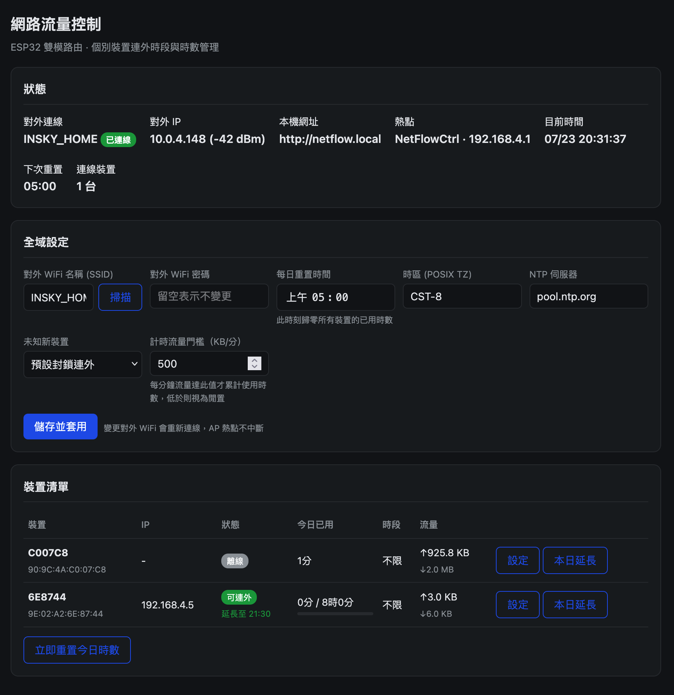
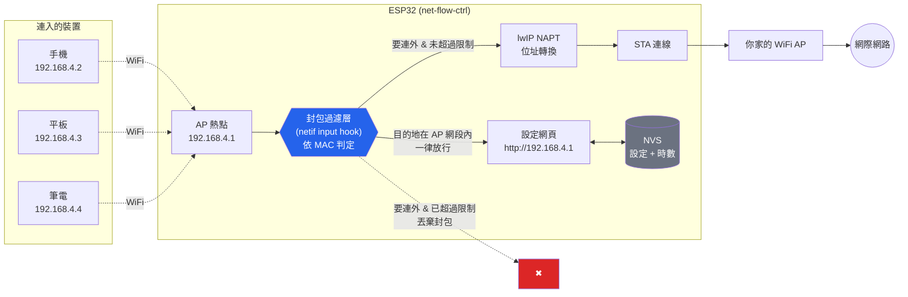
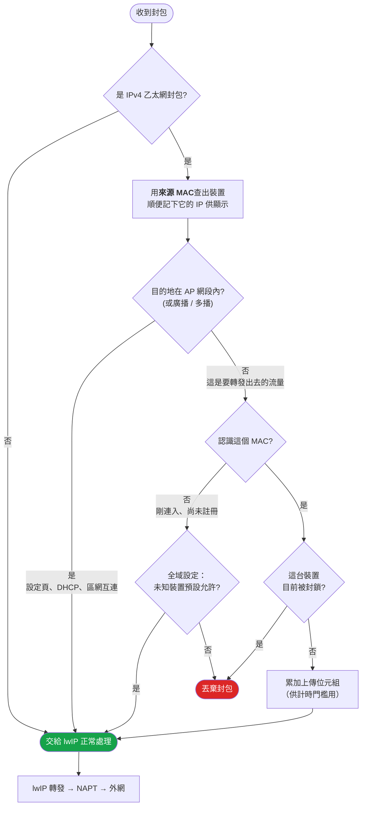
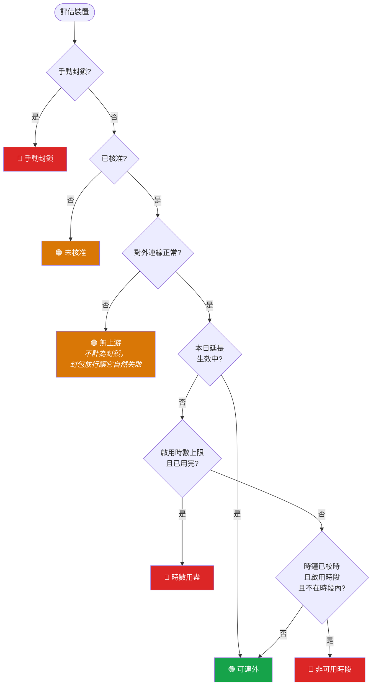
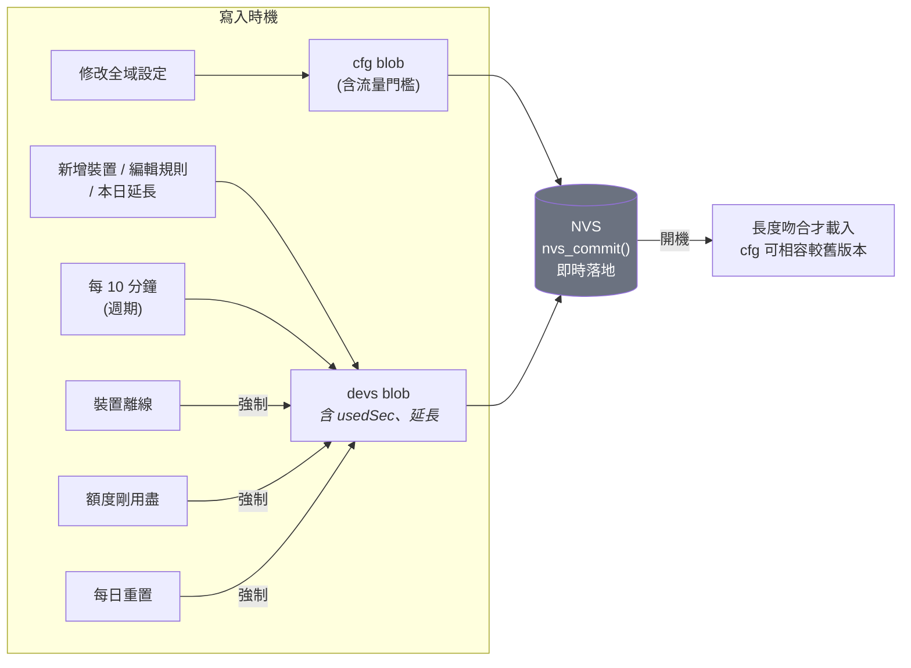
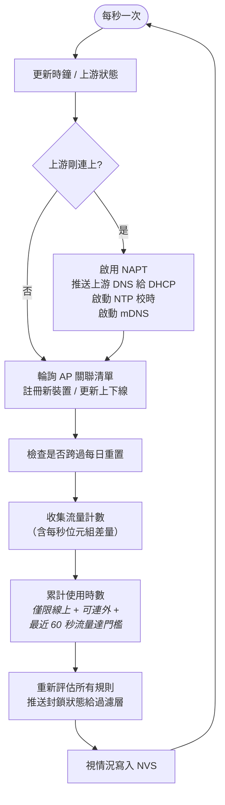

# net-flow-ctrl

ESP32 雙模 WiFi 路由器，可針對**每一台**連入熱點的裝置，個別限制它連到外網的**時段**與**每日累積時數**。主要用於管控電視盒等裝置的上網時間。

裝置連上 ESP32 的熱點，流量經 NAPT 轉發到你家的 WiFi AP 出去。超過限制的裝置會被切斷外網，但**仍然連得上熱點、也開得了設定頁**——只有要轉出去的封包被丟棄。所有設定與時數統計都存在 NVS，斷電不遺失。

ESP32 連上你家 WiFi 後，設定頁同時也開在家用網路那一側，任何同網段裝置用 **`http://netflow.local`**（mDNS）即可存取，不必連 AP 熱點。

## 設定頁預覽



單頁介面，分為狀態、全域設定、裝置清單三區；每台裝置可個別設定與「本日延長」，並顯示今日已用時數與流量。

---

## 功能

| | 說明 |
|---|---|
| **雙模連線** | 同時作為 STA（連你家 AP）與 AP（供裝置連入），NAPT 轉發提供連外 |
| **限制一：時段** | 例如只允許 06:00–21:00 連外，超出即斷網。支援跨午夜（如 22:00–02:00） |
| **限制二：每日時數** | 例如每天只能連外 8 小時，用完即斷網 |
| **任一超過即斷網** | 兩種限制獨立啟用，任一項超過就切斷外網，直到隔日重置時間 |
| **流量門檻計時** | 時數只在**實際流量達門檻**時累計（預設 200 KB/分，可調），閒置或背景雜訊不算 |
| **本日延長** | 臨時放寬某裝置到今天幾點幾分，暫時蓋過時段與時數；跨日自動失效 |
| **每日重置** | 預設早上 05:00 歸零所有裝置的已用時數（可調） |
| **網頁設定介面** | 連上熱點開 `http://192.168.4.1`，或家用網路 `http://netflow.local`，免安裝 App |
| **白名單模式** | 可設定未知新裝置預設封鎖，需在設定頁逐台核准 |
| **手動封鎖** | 永久封鎖某裝置，不受每日重置影響 |
| **流量統計** | 顯示每台裝置今日上傳／下載量（僅供參考，不作為限制條件） |

**時數只在裝置實際有連外流量、且達到門檻時才累計**——電視盒閒置、或手機放口袋整晚的背景雜訊，都不會吃掉額度。詳見下方「使用時數的計算」。

---

## 系統架構



關鍵設計：**設定頁走的是 AP 網段內部流量，不經過封鎖判定**，所以被斷網的裝置照樣能開設定頁看自己還剩多少額度。

---

## 封包決策流程

每一個從裝置送進來的封包都會經過這段判斷（執行在 WiFi RX 任務）：



**為什麼用 MAC 而不是 IP 當索引？** MAC 就在乙太網標頭裡，不需等 DHCP 租約觀測、第一個封包就能判定，而且經過 WPA2 關聯認證，裝置無法自行更改。若用 IP，裝置斷線後 IP 綁定被清除，重連到主迴圈重新綁定之間會有約 1 秒空窗套用「預設允許」——反覆重連就能繞過限制。

---

## 規則判定順序

主迴圈每秒重新評估每台裝置，結果推送給過濾層：



**本日延長**是臨時覆寫：生效期間直接放行，蓋過時數與時段兩種限制（但仍不越過手動封鎖、未核准、無上游）。它綁定當前邏輯日、跨過每日重置即失效，且需要有效時鐘才能判斷（無時鐘時視為未生效，下方的限制照常）。

### 時鐘失效時的行為（重要）

| 限制 | 無法校時（NTP 未同步）時 |
|---|---|
| **每日時數** | **照樣執行封鎖** |
| **時段** | 放行 |

**時數是累計秒數，不需要牆上時鐘**，所以即使 NTP 未同步也照樣執行——否則反覆斷電重開就能在 NTP 同步前的空窗期偷到免費上網，等於功能失效。

**時段沒有時鐘就無從判斷**，只能放行。這是刻意的取捨：若改為 fail-closed，NTP 一掛全家永久斷網且原因不明。設定頁會在狀態列顯示「未校時」警告，你也可以手動重置時數。

---

## 每日重置

計數器歸屬的「邏輯日」是把時鐘往回撥重置時間後取日期，所以換日恰好發生在重置時刻，且**重開機或錯過重置都能正確判斷**（不依賴計時器）。

```
邏輯日 = 日期( 現在時刻 − 重置時間 )
```

以預設 05:00 重置為例：

| 實際時刻 | 邏輯日 | 行為 |
|---|---|---|
| 07/17 04:59 | `20260716` | 仍屬前一日，昨日額度繼續計算 |
| 07/17 **05:00** | `20260717` | **⟵ 換日，所有時數歸零** |
| 07/17 12:00 | `20260717` | 正常累計 |
| 07/17 23:59 | `20260717` | **跨午夜不重置** |
| 07/18 04:59 | `20260717` | 仍算 07/17，額度不會提早回血 |
| 07/18 **05:00** | `20260718` | **⟵ 換日，再次歸零** |

以上每一列都已通過 host 測試驗證（見下方「測試」）。

---

## 使用時數的計算

時數**不是「連上線就算」**，而是「裝置實際在傳資料才算」。判定用一個**滑動視窗**：只要**最近 60 秒的總流量（上傳+下載）達到門檻**（預設 200 KB/分，可在設定頁調整），這一秒就計入時數。

視窗長度（60 秒）同時就是**緩衝時間**：

```
最近 60 秒總流量 ≥ 門檻  →  這一秒計時
```

| 情境 | 大約流量 | 是否計時 |
|---|---|---|
| 電視盒關機 / 深度待機 | ≈ 0 | 否 |
| 待機背景（推播、同步、EPG） | < 10 KB/分 | 否 |
| 看影片（Netflix/YouTube） | 數 MB/分以上 | **是** |
| 串流暫停、影片播放空檔 | 短暫掉到 0 | 60 秒內仍算（緩衝） |

這樣設計對電視盒特別準：真正在看影片的流量遠超門檻、一定計時；關機或待機趨近零、一定不計。串流 App「先下載一段、再安靜播放」的一陣一陣流量，靠 60 秒視窗加總也能穩定計時，不會忽斷忽續。

**一個無法避免的限制**：現在的電視盒首頁常自動播放預告片，那是**真實影片流量**，任何靠流量判斷的方法都無法分辨「自動預告」和「真的在看」——所以電視盒開著停在首頁跑預告，也會被算成使用時間。若要避免，不看時就關機／待機，或關掉首頁自動預告。

門檻在設定頁以「**KB/分**」設定（因視窗剛好 60 秒，數值即為每分鐘門檻）。此判定完全用執行期的位元組計數，不需時鐘。

---

## 本日延長

每台裝置在清單中有一個 **本日延長** 按鈕，可臨時放寬它到今天某個時刻（例如把 21:00 的時段延到 22:30，或在時數用盡後再放行一段）。

* 生效期間**同時蓋過時段與時數**兩種限制，直接放行。
* **綁定當前邏輯日**，跨過每日重置時刻（05:00）即自動失效，重置時一併清除，**跨日不保留**。
* 寫入 NVS，所以延長期間斷電重開仍有效。
* 支援跨午夜（例如 23:00 設定延長到隔天 01:00），以邏輯日相對時間判斷。
* 需要有效時鐘（它是個時間點）；無時鐘時視為未生效。

以上行為（跨午夜、跨日失效、無時鐘不生效、蓋過時數與時段）皆已通過 host 測試驗證。

---

## 資料持久化

所有設定與時數存於 ESP32 的 NVS 分區（`0x5000`，20KB）。`Preferences::putBytes()` 內部為 `nvs_set_blob()` + `nvs_commit()`，**函式回傳時資料已實際落到 flash**，不是留在 RAM 等待 flush。



時數平時每 10 分鐘寫一次以節省 flash 壽命，但**在三個關鍵時刻強制寫入**：裝置離線（連線階段結束）、額度剛用盡、每日重置。否則「14:00 用完額度被封鎖、14:05 斷電」重開後計數會退回 10 分鐘前，等於白送 10 分鐘。

**最壞情況**：突然斷電最多損失 10 分鐘的時數計算。

**Flash 壽命估算**：每天約 144 次寫入、每次約 1 KB；NVS 分區 20KB（5 個 4KB 磁區）內建磨損平衡，估算每磁區每天抹除約 10 次，以 flash 約 10 萬次抹除壽命計，可用數十年。

**版本相容**：
- **全域設定（cfg）** 採用**向前相容**載入：新欄位一律加在結構末端，載入時若偵測到較舊、較短的資料，就只讀入原有欄位、新欄位補預設值，再以新格式回寫。所以韌體升級**不會清掉你已設定的對外 WiFi、AP 密碼等**。
- **裝置規則（devs）** 要求長度與結構完全吻合。若日後修改 `DeviceRule` 或 `NFC_MAX_DEVICES`，舊資料會被安全捨棄並退回預設值（裝置重連後自動重新登記），而不是讀進錯亂內容。

---

## 主迴圈



**先累計時數再評估規則**，所以剛好用完額度的裝置在同一個 tick 內就被封鎖。

輪詢關聯清單（而非監聽 WiFi 事件）是刻意的：輪詢跑在主迴圈context，裝置資料表不需要加鎖。

---

## 硬體與燒錄

* **開發板**：ESP32 Dev Module（`esp32:esp32:esp32`）
* **需求**：arduino-cli + esp32 core 3.x + ArduinoJson 7.x
* 其餘（WebServer / Preferences / WiFi / ESPmDNS）皆為核心內建

```bash
arduino-cli compile -b esp32:esp32:esp32 .
arduino-cli upload  -b esp32:esp32:esp32 -p /dev/cu.XXXX .
```

部分 USB 轉序列晶片（如 CH340）在預設 921600 鮑率下燒錄會失敗，改用較保守的鮑率即可：

```bash
arduino-cli compile -b esp32:esp32:esp32:UploadSpeed=115200 --upload -p /dev/cu.XXXX .
```

編譯結果：Flash 約 79%（1,044,545 / 1,310,720 bytes），RAM 約 17%（56,748 bytes）。

---

## 使用

1. 燒錄後連上熱點 **`NetFlowCtrl`** / 密碼 **`12345678`**
2. 開啟 **`http://192.168.4.1`**
3. 在「全域設定」按**掃描**選擇你家的 WiFi、輸入密碼、**儲存並套用**
4. 上游連上後會自動 NTP 校時（狀態列的「未校時」警告消失），並可改用家用網路的 **`http://netflow.local`** 存取
5. 裝置連入即自動出現在清單，點**設定**個別調整；點**本日延長**臨時放寬

新裝置預設值：時段 06:00–21:00、時數 480 分鐘，但**兩項限制皆預設關閉**，需自行勾選啟用。

> AP 密碼、mDNS 主機名等預設值定義在原始碼（`nfc_store.cpp`、`nfc_config.h`）。修改預設值需重新編譯；但 AP 密碼一經設定會存入 NVS，之後以 NVS 為準。

### 設定頁功能

**全域設定**
* **每日重置時間**（預設 05:00）
* **對外 WiFi AP**（含掃描；密碼留空表示不變更）
* **計時流量門檻（KB/分）**（預設 200）
* 時區（POSIX TZ，預設 `CST-8`）、NTP 伺服器
* 未知新裝置預設允許／封鎖

**每台裝置**
* 名稱、核准、時段、時數上限、手動封鎖、刪除
* **本日延長**：臨時放寬到今天某時刻
* 立即重置今日時數（全體）

---

## 遠端存取

設定頁監聽 `0.0.0.0:80`，也就是 **AP 與 STA 兩側同時服務**。

**同一個家用 WiFi 內**：ESP32 連上你家 WiFi 後，開 **`http://netflow.local`**（mDNS，主機名 `netflow`）即可，不必連 AP、不必記會變的 DHCP IP。iPhone/iPad/Mac、較新的 Android 與 Windows 都支援 `.local`；少數舊 Android 不認時，改用狀態列顯示的實際 IP。

**從家門外（VPN 回家，如 Tailscale）**：
* `netflow.local` **不會通**——mDNS 靠多播，多播不會穿過 VPN 隧道。
* 但**用 IP 會通**：需要家裡有一台 Tailscale 節點當 **subnet router**（廣播家用網段），遠端連 ESP32 的家用 IP（如 `http://192.168.1.x`）即是普通單播，可達。ESP32 本身無法跑 Tailscale，只是繼續在家用網路提供 HTTP。
* 建議在路由器對 ESP32 設 **DHCP 保留**（固定 IP），遠端就有固定網址。
* 安全上這比 port forwarding 好得多：只有你 tailnet 內的裝置連得到，**Tailscale 本身就是那道存取控制**，所以此情境設定頁免密碼可接受。**但若改用 port forwarding 把設定頁直接開到公網，務必先加回登入驗證。**

---

## 技術細節

**為什麼要 hook netif？** arduino-cli 提供的是**預編譯** lwIP，其 sdkconfig 中 `CONFIG_LWIP_IP_FORWARD=y`、`CONFIG_LWIP_IPV4_NAPT=y`（NAPT 可用），但 IPv4 的封包 hook **並未開放**（`CONFIG_LWIP_HOOK_IP4_*` 皆非 `CUSTOM`，只有 IPv6 的），因此沒有官方途徑對轉發流量做個別裝置過濾。

解法是用 `esp_netif_get_netif_impl()` 取得 AP 的底層 `struct netif`，在執行期替換其 `input` / `linkoutput` 函式指標，把原本的指標存下來在判定後呼叫。**不需重編核心**。

**執行緒安全**：過濾層的狀態表全部是 32 位元對齊的 `volatile` 純量，Xtensa 上單次讀寫即為原子操作，封包路徑不需要鎖。MAC 位址在發布前先清除 `valid` 旗標，確保封包路徑不會讀到寫到一半的位址。流量計數器為自由計數的 32 位元值，主迴圈以無號減法對照快照取差值，跨越溢位仍正確。

**檔案結構**

| 檔案 | 職責 |
|---|---|
| `net-flow-ctrl.ino` | 主流程、每秒 tick、規則同步、mDNS 啟動 |
| `nfc_filter.cpp` | netif hook、封包過濾、流量統計、NAPT / DNS 設定 |
| `nfc_state.cpp` | 全域狀態、規則判定引擎、活躍視窗計時 |
| `nfc_store.cpp` | NVS 讀寫 |
| `nfc_portal.cpp` | HTTP 路由與 JSON API |
| `nfc_page.h` | 設定網頁（自帶樣式，不依賴外部 CDN） |
| `nfc_config.h` | 型別定義與跨模組宣告 |

網頁完全自我包含（inline CSS/JS），因為被封鎖的裝置本來就連不到外網，不能依賴任何 CDN。

**登入驗證**：目前**未啟用**。設定頁與所有 API 無需驗證即可存取，任何連上熱點的人都能修改規則。

**API**

| 端點 | 方法 | 用途 |
|---|---|---|
| `/` | GET | 設定頁 |
| `/api/status` | GET | 連線狀態、時間、線上裝置數 |
| `/api/devices` | GET | 裝置清單與規則 |
| `/api/device` | POST | 更新／刪除單一裝置規則 |
| `/api/global` | POST | 更新全域設定 |
| `/api/scan` | GET | 掃描周邊 WiFi |
| `/api/reset-usage` | POST | 立即重置今日時數 |
| `/api/extend` | POST | 設定／取消單一裝置的本日延長 |

---

## 測試

規則引擎、每日重置、本日延長、活躍視窗計時的核心邏輯皆為純函式，可在電腦上直接編譯**專案真正的** `nfc_state.cpp` 驗證，涵蓋：

* 跨午夜時段、額度邊界、判定優先序、斷電繞過情境
* 每日重置換日點（`07/18 04:59 → 邏輯日 20260717`，證明計數器跨午夜不重置、撐到隔天 05:00 才換日）
* 本日延長：跨午夜、跨日失效、無時鐘不生效、蓋過時數與時段
* 活躍視窗：背景雜訊不計、串流達門檻計時、停止後 60 秒排空停錶、緩衝式播放不斷錶

---

## 已知限制

* **設定頁沒有密碼保護**——任何連上熱點（或同家用網路）的人都能修改規則。（先前的登入驗證已移除，待重新設計。）純區網或 Tailscale 情境可接受；若曝露到公網須先加回驗證。
* **首頁自動預告也算使用時間**——電視盒首頁的自動預告是真實影片流量，任何靠流量的計時都無法排除。不看時請關機／待機，或關掉首頁自動預告。
* **最多 16 台裝置**（`NFC_MAX_DEVICES`），超過即忽略並記錄警告。
* 刪除裝置後若該裝置仍連著，下一秒會以預設值重新出現（等同「還原為預設」）。
* 掃描 WiFi 期間會短暫影響熱點連線（單一射頻硬體限制）。
* **流量統計僅供顯示**，不作為限制條件（計時用的是活躍視窗，另一套邏輯）。
* `netflow.local`（mDNS）僅在同一區網有效；VPN 遠端需用 IP + subnet router。
